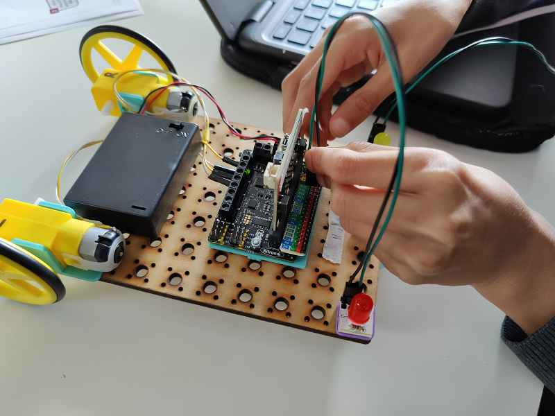
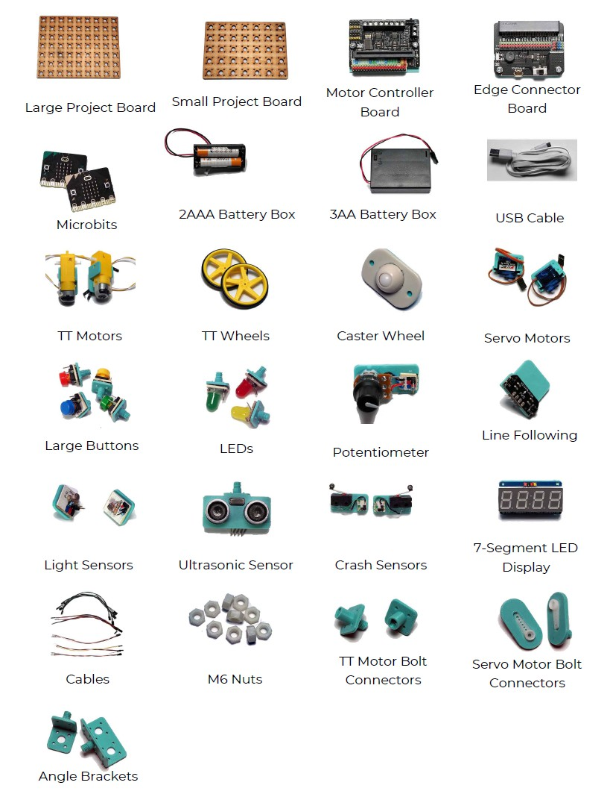

# BitMakeLab Documentation

## Digital Making
Digital Making is the creative process of combining digital technology, engineering and coding to make things!

There are numerous products, components and technologies that can be combined in this way. On the digital technology side, there are Arduinos, Microbits and Raspberry Pis to name a few. To these can be added sensors, displays, motors, cameras and other components. On the engineering side, you can use wood, plastic, cardboard and other materials and stick them together with glue, tape, screws, bolts and a host of other fastenings. On the coding side, languages such as Python and Javascript are popular, and there are simpler drag-and-drop block languages that are very beginner friendly.

Combining this huge variety of elements together can be very challenging, but that’s part of the fun! By starting out in digital making you will learn so many things and train your brain to solve a variety of problems. A useful side-effect is that your trained brain’s problem solving ability will extend well beyond digital making.

{ align=left }

## BitMakeLab
Having spent some years now teaching computer science through digital making, we’ve learnt that students love the process of making things, but can quickly get disheartened when things don’t come together the way they want. Learning resilience and perseverance is part of digital making, but it’s important not to have students fall at the first fence. They need some quick rewards to encourage them to move to the next step. But as they build confidence, they need new challenges to keep their interest as they progress.

We designed BitMakeLab to balance the needs of new students wanting to see quick results, and more experience students wanting to experiment and challenge themselves.

BitMakeLab is a set of designs and learning resources that are free to use (under the [CC BY-NC-SA Creative Commons licence](https://creativecommons.org/licenses/by-nc-sa/4.0/deed.en)). It uses standard components, such as buttons, leds and motors, that are easy to source, but simplifies it the process of using them in projects by adding them to pluggable modules. The designs for these pluggable modules are available to you, so you can make them yourself or even design your own modules.

Flexibility is key. We teach students from kids aged 8 up to adults. We use the same kit for all age groups. What we vary is the pace of delivery, the depth of the theory and the challenges I give the students that go beyond the essential making activity.

Here are a few of the basic components that make up the kit:

{ align=left }

## BitMakeLab Projects
BitMakeLab projects are a collection of worksheets, each of which guides the student through creating a single working item. Each worksheet requires around 1-2 hours to complete.

Individual worksheets may combine into a larger project group which takes students through a series of different approaches and achievements. So, for example, the “Wheeled Robots” project consists of around 7 worksheets, including Building a Basic Robot, Build a Line Following Robot and Build a Remote Control Robot.

Each project also includes a guide for tutors, detailing how to prepare and run the sessions and ideas for adapting them for students who need more of a challenge.

Feel free to dive straight into the [projects page](projects).