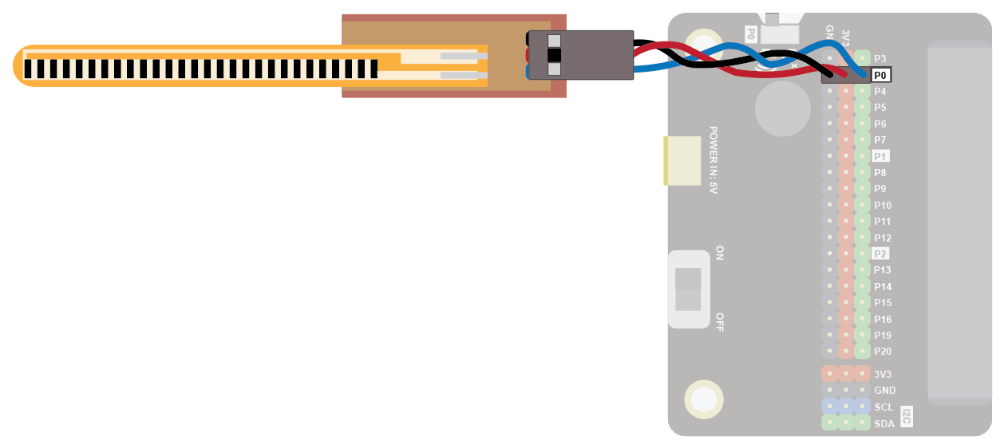
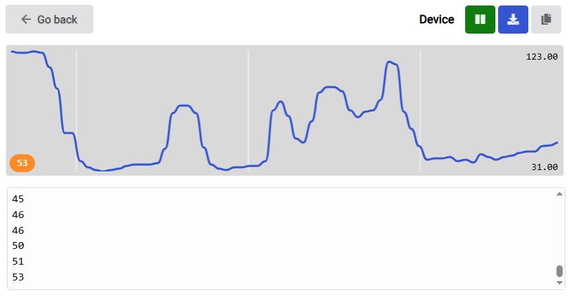
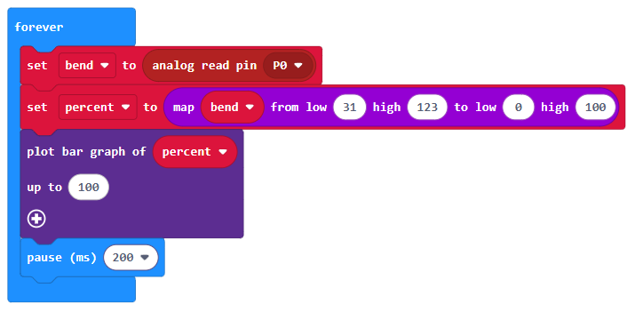
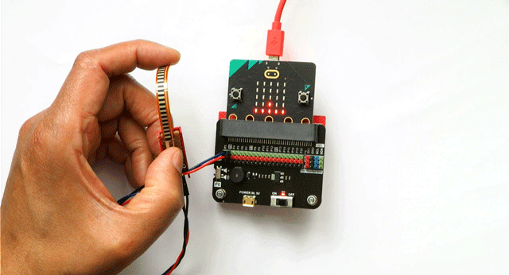

The bend sensor can be used to sense how much something bends.

Use it on your finger as a simple controller, as an antenna on a robot, and much more!

### Quick Reference
Wiring
Use a GVS cable to connect the sensor. This has 3 wires, blue, red and black:

Wire up as follows, using the Edge Connector or Motor Controller board:

### Bend Sensor	Microbit
| Component | Micro:bit |
| --- | --- |
| 3-pin connector | P0 (Analogue Pin) |

You don't have to use pin P0. You can use any analogue pin. Just remember to adjust your code accordingly.

### Coding
Enter this code in forever:

The Serial blocks can be found in Advanced.

Download the code to the microbit.

To see the data, click on Show data Device:

You should see some numbers and a graph. These show the amount of bend:

Bend the sensor and watch the values change. Make sure you don't bend it too much - bending to 90 degrees is fine.

Note down the minimum and maximum values recorded. In my example above, the range is 31 to 123. You can use these values to control other things. For example, in the code below, we can use this to control the bar graph function of the Microbit:

In the above code, the map block converts the bend value, which is in the range 31 to 123, to a percentage in the range 0 to 100.

The plot bar graph block then plots this percentage as a bar chart on the LED display:

.navBack(BitMakeLab main page)